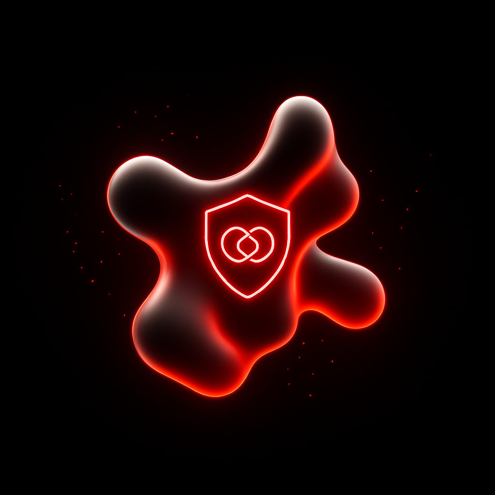

# Ownible 🌶️

**Bridging Fan Passion with Real-World Asset Investment on the Chiliz Chain.**

  

---

**🏆 A Chiliz Hacking Paris 2025 Submission 🏆**

---

## What is Ownible?

Ownible is a pioneering decentralized platform built on the **Chiliz Chain**, dedicated to tokenizing Real World Assets (RWA) from the vibrant worlds of sports and entertainment. It empowers fans to invest in, collect, and interact with digital representations of tangible assets they love.

Imagine owning a fraction of a classic album's rights, a piece of iconic sports memorabilia, or exclusive access to premier events—Ownible makes it a reality by turning them into tradable tokens.

## ✨ Core Features

- **Fractional Ownership**: Invest in fractions of high-value assets from sports, e-sports, music, and more.
- **🖼️ RWA Tokenization**: Real-world assets are represented as secure **ERC-1155 tokens** on the Chiliz Chain.
- **📊 Dynamic Marketplace**: Buy, sell, and trade asset fragments in a liquid secondary market with real-time stats.
- **🎮 Gamified Experience**: An immersive interface with a marketplace, user portfolios, and lobbies.
- **🌶️ Chiliz-Powered**: Seamless and low-cost transactions using **CHZ** with full **WalletConnect** integration.
- **🔗 Verifiable Ownership**: Each token contains an immutable **IPFS** link to asset metadata, ensuring transparency.

---

## 🛠️ Tech Stack

- **Frontend**: Next.js, React, TypeScript, Tailwind CSS, shadcn/ui
- **Wallet**: wagmi, Viem, WalletConnect
- **Blockchain**: Chiliz Chain, Solidity, Hardhat, Ethers.js
- **Decentralized Storage**: IPFS for metadata

---

## The Team

- [Emre Dedemoglu](https://www.linkedin.com/in/emre149/)
- [Mathys Cogné-Foucault](https://www.linkedin.com/in/mathys-cogne-foucault/)

---
Made for the Chiliz Hacking Paris 2025. 